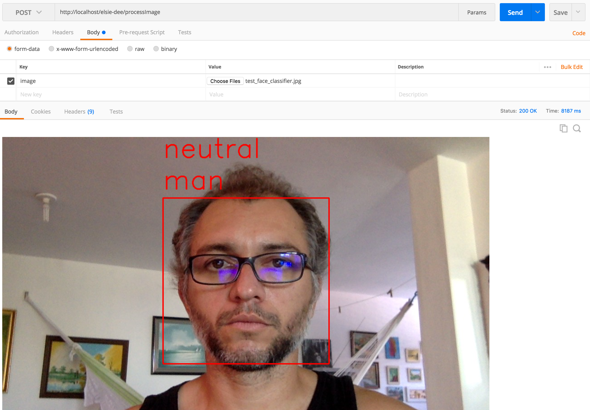

# elsie-deesight
Elsie-Dee Sight microservice used for face classification: gender and emotions.

# Dependencies

* Configuration Service
  * This microservice depends on the Configuration Service in order to retrieve its settings. It means that before starting this server,
    please make sure that the one it depends on is already running.
  * You can find out how to run the Configuration Service here: [Configuration Service](https://github.com/ekholabs/configuration-service)
* Eureka Service
  * As a second note, this microservice also dependes on the Eureka Service in order to register for service discovery. However,
    the Eureka Service does not need to be running before this one can be started.
  * You can find out how to run the Configuration Service here: [Eureka Service](https://github.com/ekholabs/eureka-service)
* Face-Classifier
  * This microservice is used to classify faces given an image. It classifies gender, age and humour. Elsie-Dee Sight uses a Feign Client as a service.
    hence the dependency.
  * You can find out how to run the Face-Classifier Service here: [Face Classifier](https://github.com/ekholabs/face_cassification)

In a dependency order priority, the Eureka Service should be started before everything else. The second in the list must be the Configuration Service.

# Pulling the Docker Image

* ```docker pull ekholabs/elsie-deesight```

# Running the Docker Container

* ```docker run -d -p 8085:8085 --link configuration-service --link eureka-service --link face-classifier ekholabs/elsie-deesight```

Elsie-Dee Sight will run on the background. To check details about the container, execute the following:

* ```docker ps```

For logs:

* ```docker logs [container_id]```

# Actuator Endpoints

Once the application is running, the user/developer can find health status and metrics via the following endpoints:

* http://localhost/elsie-deesight/health
* http://localhost/elsie-deesight/metrics
* http://localhost/elsie-deesight/env

# Processing Image Files

In order to process image files, one can use the ```/processImage``` endpoint with Postman or cURL.

## Postman



## cURL

* ```curl -v -F image=@[path_to_file] http://localhost:8085/elsie-deesight/classifyImage > image.png```

The ```image.png``` output file is the prediction made by the classifier.
